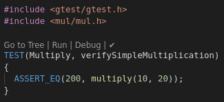
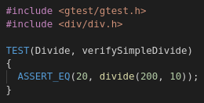

gta-bug
=======

Hit ctrl-shift-b, choose "cmake". Hit ctrl-shift-b, choose "build". Open "Test Explorer" pane, choose "Run All".

Now navigate to mul-tests->Multiply and double-click "verifySimpleMultiply". Notice that the test **does** have a "Go to Tree | Run | Debug" annotation:

Now navigate to div-tests->Divide and double-click "verifySimpleDivide". Notice that the test does **not** have a "Go to Tree | Run | Debug" annotation:

